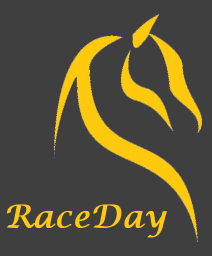

<!-- PROJECT LOGO -->
<br />
<p align="center">
  <a href="">
    
  </a>

  <h3 align="center">RACEDAY</h3>

  <p align="center">
    Australian TAB Live Racing Data review and historical data analysis
    <br />
    <br />
    <br />
  </p>
</p>

<!-- TABLE OF CONTENTS -->
<details open="open">
  <summary>Table of Contents</summary>
  <ol>
    <li><a href="#built-with">Built With</a></li>
    <li>
      <a href="#getting-started">Getting Started</a>
      <ul>
        <li><a href="#prerequisites">Prerequisites</a></li>
        <li><a href="#installation">Installation</a></li>
      </ul>
    </li>
    <li><a href="#usage">Usage</a></li>
    <li><a href="#roadmap">Roadmap</a></li>
    <li><a href="#contact">Contact</a></li>
    <li><a href="#acknowledgements">Acknowledgements</a></li>
    <li><a href="#raceday-api-server">RaceDay API Server</a></li>

  </ol>
</details>

<!-- ABOUT THE PROJECT -->

## About The Project

RaceDay is a client-server application to view live Australian TAB racing info and Historical Data.

Races are, (R)-Horse (Gallops), (H)-Harness (Trots) and (G)-Dogs (Greyhound).

The client (React) application connects to an API Server, which in turn interfaces to the TAB Corp API Server. Historical data is stored by the API Server in a No-SQL (Mongo) database (To Be Implemented).

### Built With

Key frameworks and technologies used in this project are:

- [Javascript / CSS / HTML](https://developer.mozilla.org) - Relevant to client and server components
- [React](https://reactjs.org/) - Main Client Application Code Base
- [Node](https://nodejs.org/) - Server Javascript application enviornment
- [Express](http://expressjs.com/) - Fast, unopinionated, minimalist web framework for Node.js
- [MongoDb](https://www.mongodb.com/) - NoSQL database (to be implemented)
- [Jest](https://jestjs.io/) - Testing enviornment
- [SuperTest](https://www.npmjs.com/package/supertest) - High-level abstraction for testing HTTP
- [Netlify](https://www.netlify.com/) - Web Site public hosting service

<!-- GETTING STARTED -->

## Getting Started

To get a local copy of the project up and running follow these steps.

### Prerequisites

The client and Server apps can be stood up from the terminal, however, to run up the Docker containers you will need the following as a prerequsite:

1. Docker (Docker desktop)

### Installation

1. The Client can be started locally with...
   ```sh
   CD client
   npm install
   npm start
   ```
2. The server can be started with...
   ```sh
   CD server
   npm install
   npm start
   ```
3. Alternatively, both client and server can be started in Docker from the root directory...
   ```JS
   docker-compose up --build
   ```
4. log in to begin.com and enter your Secret Key from your stripe.com account.
5. In dDocker, the Client application will be on http://localhost:3000. The Server application will be on http://localhost:5000 (API Specification endpoint)

<!-- USAGE EXAMPLES -->

## Usage

A live version of the site has been deployed to: https://ws-raceday.netlify.app/

<!-- ROADMAP -->

## Roadmap

Future functionaility will include:

- Adding a No-SQL DB (Mongo) to store data for analysis.
- Adding Security to enable Authentication & Authorisation for data analysisaccess.
- Improving useability and 'look & feel' for the Client application.

<!-- CONTACT -->

## Contact

Should you have any questions, the project team members are:

Warrick Smith - https://github.com/WarrickSmith

Project Link: [https://github.com/WarrickSmith/raceday]

<!-- ACKNOWLEDGEMENTS -->

## Acknowledgements

- [Tabcorp API Web Site 'TAB Studio'](https://www.studio.tab.com.au/)
- [favicon.io to geneate favicon.ico from a jpg](hhttps://favicon.io/favicon-converter/)
- [tinypng.com for reducing image sizes](https://tinypng.com/)
- [GitHub Pages](https://pages.github.com)

[product-screenshot]: public/thhome.png

<!-- RaceDay API Server -->

## RaceDay API Server

The RaceDay Server has an API conforming with OpenApi 3.0.1. The public specification can be viewed at: https://warricksmith.com/server/
